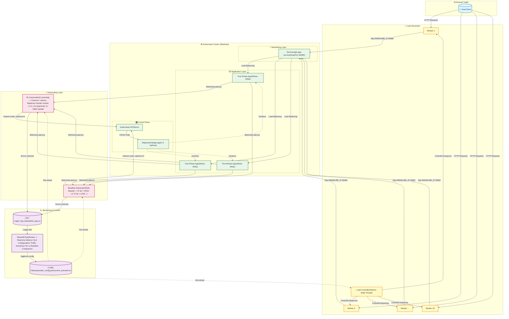

#  Kubernetes Edge Cloud with RL Autoscaler

[](#)
[](#)
[](#)
[](#)
[](#license)

> Progetto per l’insegnamento **Virtual Networks and Cloud Computing** (a.a. **2024/25**)  
> Autore: **Daniele Nanni Cirulli**

Questo progetto implementa un **Edge Cloud Autoscaler** su **Kubernetes** basato su **Reinforcement Learning (Q-Learning)**.  
L’agente apprende autonomamente come scalare le risorse (Pod) per mantenere bassa la latenza minimizzando i costi, ed è confrontato con un approccio tradizionale **rule-based** (baseline a soglia fissa).

---

## 📚 Indice

- [📸 Dashboard Preview](#-dashboard-preview)
- [🌟 Caratteristiche Principali](#-caratteristiche-principali)
- [🏗️ Architettura del Sistema](#️-architettura-del-sistema)
- [📁 Struttura del Progetto](#-struttura-del-progetto)
- [🚀 Installazione](#-installazione)
- [🎮 Esecuzione della Demo](#-esecuzione-della-demo)
- [🧪 Metodologia di Confronto (Workflow Tesi)](#-metodologia-di-confronto-workflow-tesi)
- [🧠 Teoria: Q-Learning Setup](#-teoria-q-learning-setup)
- [✅ Risultati Ottenuti](#-risultati-ottenuti)
- [📄 License](#-license)

---

## 📸 Dashboard Preview

> Inserisci qui uno screenshot della Dashboard in modalità **Confronto Diretto**.


---

## 🌟 Caratteristiche Principali

- **🧠 Agente RL intelligente:** Q-Learning per apprendere la policy di scaling senza regole preimpostate.
- **⚖️ Baseline comparison:** autoscaler tradizionale (rule-based) per confronto sperimentale.
- **📊 Control Center interattivo:** dashboard Streamlit per monitorare metriche in tempo reale, cambiare scenari di traffico e modificare soglie SLA “on the fly”.
- **🌊 Traffic injection:** generatore di carico per simulare scenari realistici (*Calma, Spike, Onda sinusoidale, Stop*).
- **🐳 Cloud-native:** containerizzazione + orchestrazione su Kubernetes (Minikube).

> Nota: anche la baseline produce uno **score/reward di valutazione** (calcolato a posteriori) per poter confrontare baseline e RL sulla **stessa metrica**. La baseline **non** usa tale reward per decidere.

---

## 🏗️ Architettura del Sistema

Il sistema è un loop di controllo chiuso (MAPE Loop: *Monitor, Analyze, Plan, Execute*).



---

## 📁 Struttura del Progetto

```text
kube-rl-edge/
├── app/                  # Microservizio Edge (Flask) + Dockerfile
├── k8s/                  # Manifest Kubernetes (Deployment + Service)
├── autoscaler/           # Logica di Autoscaling
│   ├── rl_autoscaler.py        # Agente Q-Learning
│   └── baseline_autoscaler.py  # Autoscaler Rule-Based
├── load/                 # Generatore di traffico (Python)
├── results/              # CSV log e output (grafici/screenshot)
├── dashboard_ultra.py    # Control Center (Web UI)
├── plot_results.py       # Script per generare grafici (tesi)
└── requirements.txt      # Dipendenze Python
```

---

## 🚀 Installazione

### 1) Prerequisiti

- Docker Desktop (o Docker Engine su Linux)
- Minikube & kubectl
- Python 3.10+

### 2) Setup iniziale

Clona il repository e prepara l’ambiente virtuale:

```bash
git clone https://github.com/Daniele-00/vncc-kubernetes-edge-rl-autoscaler.git
cd vncc-kubernetes-edge-rl-autoscaler

python3 -m venv venv
source venv/bin/activate   # Windows: venv\Scripts\activate

pip install -r requirements.txt
```

### 3) Avvio del cluster

Avvia Minikube e deploya l’applicazione:

```bash
minikube start --driver=docker
eval $(minikube docker-env)             # usa il Docker daemon di Minikube

docker build -t edge-app:latest ./app
kubectl apply -f k8s/deployment.yaml
kubectl apply -f k8s/service.yaml       # se presente
```

Verifica che tutto sia pronto:

```bash
kubectl get pods
# Attendi che lo stato sia Running
```

---

## 🎮 Esecuzione della Demo

Per una dimostrazione completa, apri **4 terminali**:

### Terminale 1 — Monitor Kubernetes

Osserva i Pod crearsi/distruggersi in tempo reale:

```bash
kubectl get deploy edge-app -w
```

### Terminale 2 — Generatore di carico

Inietta traffico HTTP verso il cluster:

```bash
export MINIKUBE_IP=$(minikube ip)
python load/load_generator.py
```

> Nota: lo scenario si comanda dalla Dashboard.

### Terminale 3 — Autoscaler

Scegli se avviare l’agente RL o la baseline.

**Opzione A: Reinforcement Learning**
```bash
export MINIKUBE_IP=$(minikube ip)
python autoscaler/rl_autoscaler.py
```

**Opzione B: Baseline (Rule-Based)**
```bash
export MINIKUBE_IP=$(minikube ip)
python autoscaler/baseline_autoscaler.py
```

### Terminale 4 — Dashboard (Control Center)

```bash
streamlit run dashboard_ultra.py
```

Apri il browser all’indirizzo mostrato (es. `http://localhost:8501`).

---

## 🧪 Metodologia di Confronto (Workflow Tesi)

Per riprodurre i grafici di confronto:

1. Avvia `rl_autoscaler.py` e imposta lo scenario **Onda** dalla Dashboard.
2. Lascia girare per ~10 minuti (training), poi ferma lo script (**Ctrl+C**).
3. Resetta il cluster:
   ```bash
   kubectl scale deploy edge-app --replicas=1
   ```
4. Avvia `baseline_autoscaler.py` con lo **stesso scenario**.
5. Lascia girare per ~5 minuti, poi ferma lo script.
6. Nella Dashboard seleziona **⚔️ CONFRONTO DIRETTO**.
7. Esegui lo script di plotting (adatta al tuo nome file):
   ```bash
   python plot_compare.py
   ```
   per generare PNG/HTML per la documentazione.

---

## 🧠 Teoria: Q-Learning Setup

Il problema è modellato come un **MDP** (Markov Decision Process):

* **Stato ($S$):** Tupla composta da `{Latency_Bucket, Current_Replicas}`.
* **Azione ($A$):** Insieme discreto `{-1, 0, +1}` (Scale DOWN, Hold, Scale UP).
* **Reward ($R$):**
    $$R = R_{SLA} - (C_{cost} \times N_{replicas})$$
    Dove $R_{SLA}$ è un valore positivo (es. +5) se la latenza è sotto il target, e negativo (es. -5) se supera la soglia critica. $C_{cost}$ è il peso del costo per ogni replica attiva.

* **Q-Table Update (Bellman Equation):**
    $$Q(s,a) \leftarrow Q(s,a) + \alpha \left[ r + \gamma \max_{a'} Q(s',a') - Q(s,a) \right]$$
    
    Dove:
    * $\alpha$: Learning Rate (velocità di apprendimento)
    * $\gamma$: Discount Factor (importanza del futuro)

---

## ✅ Risultati Ottenuti

L’agente RL dimostra di saper:

- **Ridurre i costi** diminuendo le repliche quando il traffico cala, più rapidamente della baseline.
- **Stabilizzare il sistema** evitando l’effetto “yo-yo” (*flapping*) tipico degli algoritmi a soglia fissa.
- **Adattarsi a SLA dinamici** modificati in tempo reale tramite la Dashboard.

---

## 💡 Consigli per fare bella figura

1. **Screenshot:** fai uno screenshot reale della dashboard in modalità *Confronto Diretto* e salvalo come `results/dashboard_preview.png`. Verrà mostrato automaticamente nel README.
2. **IP Minikube:** l’uso di `export MINIKUBE_IP=$(minikube ip)` evita di modificare il codice ogni volta.
   - Windows PowerShell:  
     ```powershell
     $env:MINIKUBE_IP = (minikube ip)
     ```
3. **Diagramma Mermaid:** GitHub renderizza nativamente il diagramma Mermaid ed è perfetto per la relazione.

---

## 📄 License

Distribuito sotto licenza **MIT**. Vedi `LICENSE` per dettagli.
