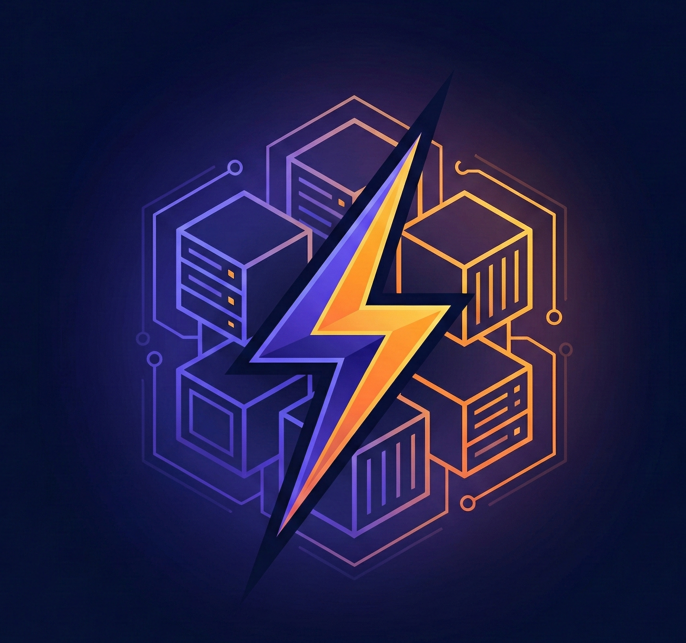
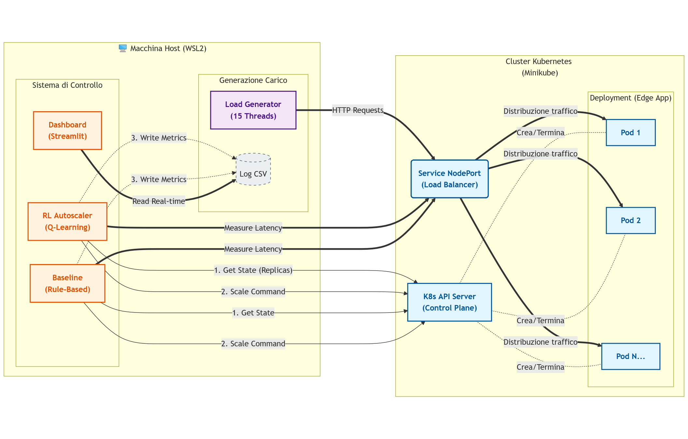
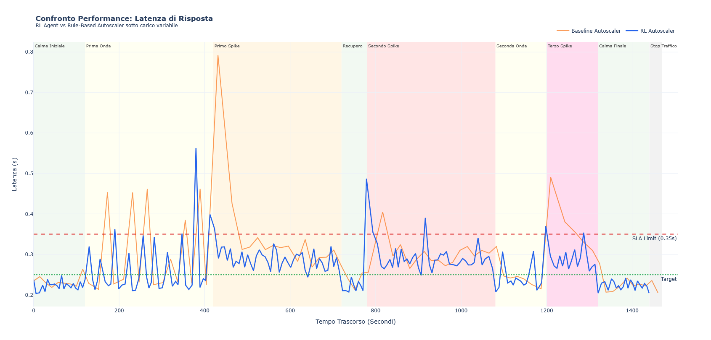

#  Kubernetes RL Autoscaler for Edge Computing

[](https://www.python.org/)
[](https://kubernetes.io/)
[](https://www.docker.com/)
[](https://streamlit.io/)
[](LICENSE)

> **Corso:** Virtual Networks and Cloud Computing (A.A. 2024/2025)  
> **Autore:** Daniele Nanni Cirulli 
> **Università degli Studi di Perugia** - Dipartimento di Ingegneria

---

## Indice

- [Panoramica del Progetto](#panoramica-del-progetto)
- [Limiti Approccio](#limiti-approccio)
- [Architettura del Sistema](#️architettura-del-sistema)
- [Tecnologie Utilizzate](#tecnologie-utilizzate)
- [Quick Start](#quick-start)
- [Installazione Dettagliata](#installazione-dettagliata)
- [Metodologia Training/Evaluation](#metodologia-trainingevaluation)
- [Modello Teorico (Q-Learning)](#modello-teorico-q-learning)
- [Risultati Sperimentali](#risultati-sperimentali)
- [Struttura del Progetto](#struttura-del-progetto)
- [Contatti](#contatti)

---

## Panoramica del Progetto

Questo progetto implementa un sistema di **autoscaling intelligente** per ambienti **Edge Computing** utilizzando **Reinforcement Learning (Q-Learning)**. Il sistema è stato sviluppato come applicazione cloud-native completamente funzionante su **Kubernetes (Minikube)**, dimostrando come l'apprendimento automatico possa superare approcci tradizionali rule-based nella gestione dinamica delle risorse.

### Metodologia Utilizzata

- **Separazione Training/Evaluation**: Fase di addestramento separata da fase di valutazione per confronto scientifico 
- **Reward Zone-Based**: Funzione reward adattiva con pesi dinamici che variano in base allo stato del sistema
- **Fase di training**: 6 super-cicli randomizzati (calma/onda/spike) per evitare overfitting
- **Metrica SLA Met**: Percentuale di episodi con latenza ottimale, più informativa delle semplici violazioni

### Risultati Principali

| Metrica | Baseline | RL (Eval) | Delta |
|---------|----------|-----------|-------|
| **SLA Met** | 86.6% | **95.1%** | **+8.5 punti** ✅ |
| Latenza Media | 0.290s | 0.264s | -8.9% ✅ |
| Repliche Medie | 2.34 | 2.56 | +9.4% ⚠️ |
| Efficiency (SLA/Cost) | 0.370 | 0.371 | Pari ✅ |

---

## Problema e Soluzione

### Il Problema: Autoscaling in Edge Computing

L'Edge Computing sposta l'elaborazione dai datacenter centralizzati verso dispositivi periferici, introducendo sfide uniche:

- **Risorse Limitate**: CPU, memoria ed energia ridotte sui nodi Edge
- **Carichi Imprevedibili**: Traffico altamente variabile e difficile da predire
- **Latenza Critica**: Necessità di tempi di risposta bassi per applicazioni real-time
- **Efficienza Economica**: Minimizzare costi evitando over-provisioning

### Limiti degli Approcci Tradizionali

Gli autoscaler rule-based (es. Kubernetes HPA) utilizzano soglie fisse:

```python
if latency > HIGH_THRESHOLD:
    scale_up()
elif latency < LOW_THRESHOLD:
    scale_down()
```

**Limiti Approccio**
- Reazione ritardata (attendono superamento soglie)
- Assenza di memoria storica
- Possibile flapping
- Configurazione manuale per ogni workload
- Comportamento subottimale sotto carichi variabili

### La Soluzione: Q-Learning con Train/Eval Split

L'agente RL apprende una policy ottimale in due fasi distinte:

1. **Training**: Esplora lo spazio stati-azioni su pattern randomizzati, costruisce Q-Table
2. **Evaluation**: Usa Q-Table salvata (zero esplorazione) per confronto equo con baseline

**Vantaggi:**
- Apprende strategie adattive senza regole esplicite
- Bilancia automaticamente latenza e costi tramite reward
- Policy più reattiva (adatta repliche seguendo carico istantaneo)

---

## Architettura del Sistema

<p align="center">
  
</p>

### Flusso Dettagliato

1. **Monitor**: Autoscaler misura latenza media (batch di richieste di prova)
2. **Analyze**: Discretizza latenza in bucket (LOW/TARGET/HIGH)
3. **Plan**: Seleziona azione
   - RL: Consulta Q-Table appresa → `a = argmax Q(s, a)`
   - Baseline: Applica regola IF-THEN
4. **Execute**: `kubectl scale deploy --replicas=N`
5. **Log**: Persist metriche su CSV per dashboard e analisi offline

---

## Tecnologie Utilizzate

| Componente | Versione | Ruolo |
|-----------|---------|-------|
| **Python** | 3.12.3 | Linguaggio principale (RL, autoscaler, load) |
| **Kubernetes** | v1.34.0 | Orchestrazione container |
| **Minikube** | v1.37.0 | Cluster locale single-node |
| **Docker** | 28.4.0 | Containerizzazione microservizi |
| **Flask** | 3.1.2 | Microservizio Edge app |
| **Streamlit** | 1.51.0 | Dashboard web interattiva |
| **Plotly** | 6.4.0 | Grafici interattivi (time series, box plot) |
| **NumPy** | 2.3.4 | Operazioni Q-Table |
| **Pandas** | 2.3.3 | Manipolazione CSV logs |

**Ambiente**: Windows 11 + WSL 2 Ubuntu 24.04

---

## Quick Start

```bash
# 1. Setup cluster
minikube start --driver=docker --cpus=4 --memory=4096
eval $(minikube docker-env)

# 2. Build & Deploy
docker build -t edge-app:latest ./app
kubectl apply -f k8s/deployment.yaml

# 3. Terminale 1: Monitor Kubernetes
kubectl get deploy edge-app -w

# 4. Terminale 2: Load Generator
export MINIKUBE_IP=$(minikube ip)
python load/load_controller.py

# 5. Terminale 3: RL Autoscaler (EVAL mode)
export RL_MODE=eval  # Usa Q-Table già addestrata
python autoscaler/rl_autoscaler.py

# 6. Terminale 4: Dashboard
streamlit run ui/dashboard.py
# Vai su http://localhost:8501
```

---

## Installazione Dettagliata

<details>
<summary>➕ Clicca per espandere</summary>

### Prerequisiti

#### Windows
```powershell
# Installa Docker Desktop, Minikube, kubectl
# Link: https://docs.docker.com/desktop/install/windows-install/
```

#### macOS
```bash
brew install minikube kubectl docker
```

#### Linux (Ubuntu/Debian)
```bash
# Docker
curl -fsSL https://get.docker.com | sh

# Minikube
curl -LO https://storage.googleapis.com/minikube/releases/latest/minikube-linux-amd64
sudo install minikube-linux-amd64 /usr/local/bin/minikube

# kubectl
curl -LO "https://dl.k8s.io/release/$(curl -Ls https://dl.k8s.io/release/stable.txt)/bin/linux/amd64/kubectl"
sudo install kubectl /usr/local/bin/kubectl
```

### Setup Progetto

```bash
# Clone repository
git clone https://github.com/Daniele-00/vncc-kubernetes-edge-rl-autoscaler.git
cd vncc-kubernetes-edge-rl-autoscaler

# Virtual environment Python
python3 -m venv venv
source venv/bin/activate  # Windows: venv\Scripts\activate
pip install -r requirements.txt

# Test connettività
export MINIKUBE_IP=$(minikube ip)
curl http://$MINIKUBE_IP:30080  # Output atteso: OK (dopo ~200ms)
```

</details>

---

## Metodologia Training/Evaluation

### Perché Separare Training ed Evaluation?

Senza separazione, il confronto RL vs Baseline non sarebbe equo: l'RL includerebbe episodi di esplorazione casuale (azioni subottimali intenzionali) che penalizzerebbero le sue performance.

### Protocollo Implementato

#### Fase 1: Training (RL\_MODE=train)

```bash
export RL_MODE=train
python autoscaler/rl_autoscaler.py
python benchmark/training_benchmark.py  # Orchestr curriculum
```

- **Durata**: ~34 minuti (~200 episodi)
- **Scenari**: 6 super-cicli randomizzati (calma/onda/spike)
- **Epsilon**: Decay da 0.9 → 0.1
- **Output**: Q-Table salvata su `results/qtable.npy`
- **Log**: `results/rl_train_log.csv`

#### Fase 2: Evaluation RL (RL\_MODE=eval)

```bash
kubectl scale deploy edge-app --replicas=1  # Reset
export RL_MODE=eval
python autoscaler/rl_autoscaler.py
python benchmark/benchmark.py  # Scenario DETERMINISTICO
```

- **Q-Table**: Caricata da disco (frozen)
- **Epsilon**: Forzato a 0 (zero esplorazione)
- **Scenario**: benchmark.py (identico per baseline)
- **Output**: `results/rl_eval_log.csv`

#### Fase 3: Evaluation Baseline

```bash
kubectl scale deploy edge-app --replicas=1  # Reset
python autoscaler/baseline_autoscaler.py
python benchmark/benchmark.py  # STESSO scenario RL
```

- **Output**: `results/baseline_log.csv`

### Differenza Chiave: training\_benchmark.py vs benchmark.py

| Script | Fase | Randomizzazione | Scopo |
|--------|------|-----------------|-------|
| `training_benchmark.py` | Train | Ordine + durata casuale | Irrobustire policy, evitare overfitting |
| `benchmark.py` | Eval | Sequenza fissa deterministica | Confronto equo RL vs Baseline |

---

## Modello Teorico (Q-Learning)

### MDP Formulation

**Stato**: $s = (l, n)$ dove $l \in \{0, 1, 2\}$ (bucket latenza), $n \in \{1,...,5\}$ (repliche)  
→ **15 stati totali**

**Azioni**: $\mathcal{A} = \{-1, 0, +1\}$ (Scale Down, Hold, Scale Up)

**Reward Zone-Based**:

$$
R(s, a) = \underbrace{R_{\text{SLA}}(l)}_{\text{QoS}} + \underbrace{R_{\text{cost}}(n, l)}_{\text{Efficienza}} + \underbrace{R_{\text{shape}}(a, l)}_{\text{Bias}}
$$

**Q-Learning Update**:

$$
Q(s,a) \leftarrow Q(s,a) + \alpha \left[ r + \gamma \max_{a'} Q(s',a') - Q(s,a) \right]
$$

Parametri: $\alpha=0.1$, $\gamma=0.9$, $\epsilon(t) = \max(0.9 \cdot 0.985^t, 0.1)$

---

## Risultati Sperimentali

### Setup

- **Hardware**: AMD Ryzen 7 8845HS, 32 GB RAM, WSL 2 Ubuntu
- **Scenario Eval**: benchmark.py
- **Soglie SLA**: Low=0.25s, High=0.35s

### Metriche Comparative

| Metrica | Baseline | RL (Eval) | Interpretazione |
|---------|----------|-----------|-----------------|
| **Latenza Media** | 0.290s | 0.264s | RL 8.9% più veloce ✅ |
| **Repliche Medie** | 2.34 | 2.56 | RL 9.4% più costoso ⚠️ |
| **SLA Met** | **86.6%** | **95.1%** | RL +8.5 punti ✅ |
| **Violazioni SLA** | 11 | 10 | 1 violazione evitata ✅ |
| **Efficiency** | 0.370 | 0.371 | Sostanzialmente pari ✅ |

### Conclusioni

**Qualità del Servizio**: L'RL mantiene latenza ottimale nel 95.1% degli episodi contro 86.6% della baseline. Questo è un risultato interessante da tenere in considerazione.

**Trade-off Costi/QoS**: L'RL utilizza 9.4% di risorse in più, ma l'**SLA Efficiency** (0.371 vs 0.370) è identica. Questo indica che il sistema ha raggiunto un equilibrio ottimale: l'overhead è proporzionale al miglioramento qualitativo.

**Reattività vs Stabilità**: L'RL adatta più frequentemente le repliche seguendo il carico istantaneo (comportamento dinamico), mentre la baseline è più stabile ma anche più lenta a reagire. Questa maggiore reattività dell'RL è il **prezzo** da pagare per ottenere 95.1% SLA Met.

### Grafici



*Le bande colorate verticali indicano lo scenario attivo. L'RL adatta dinamicamente le repliche, la baseline mantiene configurazioni più stabili ma meno reattive.*

---

## Struttura del Progetto

```
kube-rl-edge/
├── app/                          # Microservizio Edge
│   ├── app.py                    # Flask server (200ms delay)
│   └── Dockerfile                # Containerizzazione
├── autoscaler/                   # Logica Autoscaling
│   ├── rl_autoscaler.py          # Agente Q-Learning (train/eval)
│   ├── baseline_autoscaler.py    # Controller rule-based
│   └── reward_utils.py           # Reward function
├── k8s/                          # Manifest Kubernetes
│   └── deployment.yaml           # Deployment + Service NodePort
├── benchmark/                    # Scripts Benchmark
│   ├── training_benchmark.py     # Curriculum randomizzato (train)
│   └── benchmark.py              # Scenario deterministico (eval)
├── load/                         # Generazione Traffico
│   └── load_controller.py        # Multi-thread load (15 worker)
├── ui/                           # Dashboard
│   └── dashboard.py              # Streamlit UI con zone semantiche
├── plots/                        # Plotting
│   └── plot_compare.py           # Grafici confronto RL vs Baseline
├── results/                      # Output
│   ├── rl_train_log.csv          # Log training (con epsilon)
│   ├── rl_eval_log.csv           # Log evaluation RL
│   ├── baseline_log.csv          # Log evaluation baseline
│   └── qtable.npy                # Q-Table addestrata
└── requirements.txt              # Dipendenze Python
```

---

## Sviluppi Futuri

- **Deep RL**: DQN per spazi stati continui e multi-dimensionali
- **Multi-Cluster**: Cooperative multi-agent RL per Edge distribuito
- **Transfer Learning**: Pre-training su workload sintetici + fine-tuning

---

## Contatti

**Daniele Nanni Cirulli**

- 📧 Email: [daniele.nannicirulli@studenti.unipg.it](mailto:daniele.nannicirulli@studenti.unipg.it)
- 🔗 LinkedIn: [linkedin.com/in/daniele-nanni-cirulli](https://www.linkedin.com/in/daniele-nanni-cirulli-6052b2231/)
- 🐙 GitHub: [@Daniele-00](https://github.com/Daniele-00)

**Università degli Studi di Perugia**  
Dipartimento di Ingegneria  
A.A. 2024/2025

---

<div align="center">

### ⭐ Se questo progetto ti è stato utile, lascia una stella!

**Sviluppato con 💙 per il corso di Virtual Networks and Cloud Computing**

[🔝 Torna all'Inizio](#-kubernetes-rl-autoscaler-for-edge-computing)

</div>
