#  Kubernetes RL Autoscaler for Edge Computing

[](https://www.python.org/)
[](https://kubernetes.io/)
[](https://www.docker.com/)
[](https://streamlit.io/)
[](LICENSE)
[](CONTRIBUTING.md)

> **Corso:** Virtual Networks and Cloud Computing (A.A. 2024/2025)  
> **Autore:** Daniele Nanni Cirulli

> **Università degli Studi di Perugia** - Dipartimento di Ingegneria

---

## Indice

- [Panoramica del Progetto](#panoramica-del-progetto)
- [Problema Affrontato](#problema-affrontato)
- [Soluzione Proposta](#soluzione-proposta)
- [Caratteristiche Principali](#caratteristiche-principali)
- [Architettura del Sistema](#architettura-del-sistema)
- [Tecnologie Utilizzate](#tecnologie-utilizzate)
- [Quick Start](#quick-start)
- [Installazione Dettagliata](#installazione-dettagliata)
- [Guida all'Utilizzo](#guida-allutilizzo)
- [Metodologia di Confronto](#metodologia-di-confronto)
- [Modello Teorico](#modello-teorico)
- [Risultati Sperimentali](#risultati-sperimentali)
- [Struttura del Progetto](#struttura-del-progetto)
- [Sviluppi Futuri](#sviluppi-futuri)
- [Contatti](#-contatti)

---

## Panoramica del Progetto

Questo progetto implementa un sistema di **autoscaling intelligente** per ambienti **Edge Computing** utilizzando **Reinforcement Learning (Q-Learning)**. Il sistema è stato sviluppato come applicazione cloud-native completamente funzionante su **Kubernetes (Minikube)**, dimostrando come l'intelligenza artificiale possa superare approcci tradizionali rule-based nella gestione dinamica delle risorse.

### Dashboard in Azione


*Dashboard Streamlit in modalità Confronto Diretto - Monitoraggio real-time delle metriche RL vs Baseline*

---

## Problema Affrontato

### Contesto: Edge Computing

L'Edge Computing sposta l'elaborazione dei dati dai datacenter centralizzati verso dispositivi periferici più vicini agli utenti finali. Questo paradigma introduce sfide uniche:

- **Risorse Limitate**: Nodi edge con capacità computazionali ridotte (CPU, memoria, energia)
- **Carichi Variabili**: Traffico altamente imprevedibile e fluttuante nel tempo
- **Latenza Critica**: Necessità di mantenere tempi di risposta bassi per applicazioni real-time
- **Efficienza Economica**: Minimizzare costi operativi evitando over-provisioning

### Limiti degli Approcci Tradizionali

Gli autoscaler tradizionali (es. Kubernetes HPA - Horizontal Pod Autoscaler) utilizzano **regole a soglia fissa**:

```python
if metric > HIGH_THRESHOLD:
    scale_up()
elif metric < LOW_THRESHOLD:
    scale_down()
```

Questi sistemi presentano problematiche critiche:

1. **Flapping**: Oscillazioni continue tra scale-up e scale-down che degradano le performance
2. **Assenza di Memoria**: Ogni decisione è indipendente, senza apprendimento dalla storia passata
3. **Configurazione Manuale**: Richiedono tuning costante delle soglie per ogni workload
4. **Reattività Limitata**: Reagiscono solo agli eventi correnti, senza anticipare trend

---

## Soluzione Proposta

### Reinforcement Learning per Autoscaling

Il progetto sostituisce la logica rule-based con un **agente intelligente** basato su Q-Learning che:

**Apprende Autonomamente**: Scopre la strategia ottimale di scaling interagendo con l'ambiente  
**Bilancia Obiettivi Multipli**: Minimizza latenza (QoS) e costi (numero repliche) simultaneamente  
**Adatta la Policy**: Si adatta a pattern di traffico complessi senza regole esplicite  
**Memorizza Esperienza**: Utilizza la Q-Table per ricordare strategie efficaci in ogni stato  

### Validazione Sperimentale

Il sistema include un **autoscaler baseline rule-based** che permette confronti quantitativi diretti su:
- **Qualità del Servizio** (latenza media, violazioni SLA)
- **Efficienza Economica** (numero medio di repliche)
- **Stabilità** (varianza delle configurazioni, assenza di flapping)

---

## Caratteristiche Principali

### Core Features

- **Agente RL Intelligente**
  - Algoritmo Q-Learning tabular con epsilon-greedy decay
  - Spazio stati discreto (15 stati): `{Latency_Bucket × Current_Replicas}`
  - Spazio azioni: `{-1, 0, +1}` (Scale Down, Hold, Scale Up)
  - Reward function bilanciata per QoS e costi

- **Baseline Comparativa**
  - Autoscaler rule-based con soglie configurabili
  - Reward post-hoc per confronto equo sulla stessa metrica
  - Evidenzia limiti degli approcci tradizionali (flapping)

- **Dashboard Interattiva Streamlit**
  - **3 Modalità Operative**: RL / Baseline / Confronto Diretto
  - Modifiche SLA dinamiche senza restart
  - Grafici real-time: serie temporali, box plot, KPI cards
  - Controllo scenari di traffico

- **Traffic Generator Multi-Scenario**
  - 15 Thread thread concorrenti per saturazione realistica
  - 4 pattern di traffico: Calma, Spike, Onda sinusoidale, Stop
  - Configurabile via dashboard senza riavvio

- **Architettura Cloud-Native**
  - Microservizi containerizzati (Docker)
  - Orchestrazione Kubernetes su Minikube
  - Manifest YAML production-ready
  - Logging strutturato su CSV per analisi

### Design Principles

- **Riproducibilità**: Setup automatizzato
- **Modularità**: Componenti disaccoppiati comunicanti via API Kubernetes
- **Osservabilità**: Metriche dettagliate su latenza, repliche, reward, epsilon
- **Estensibilità**: Architettura pronta per Deep RL (DQN, PPO) e multi-cluster

---

## Architettura del Sistema

### Schema Architetturale Completo

```mermaid
flowchart TB
    subgraph External["External Traffic"]
        USER[("User/Client")]
    end
    
    subgraph LoadGen["Load Generator"]
        LG["Load Controller<br/>(Python Multi-Thread)"]
        W1["Thread 1"]
        W2["Thread 2"]
        W3["Thread ..."]
        W15["Thread 15"]
        
        LG -->|Controlla frequenza| W1 & W2 & W3 & W15
    end
    
    subgraph K8s["Kubernetes Cluster (Minikube)"]
        subgraph Network["Networking Layer"]
            SVC["Service<br/>edge-app-service<br/>(NodePort 30080)"]
        end
        
        subgraph Workload["Application Layer"]
            POD1["Pod 1<br/>Flask App<br/>(200ms delay)"]
            POD2["Pod 2<br/>Flask App<br/>(200ms delay)"]
            POD3["Pod N<br/>Flask App<br/>(200ms delay)"]
        end
        
        subgraph Control["Control Plane"]
            DEP["Deployment<br/>edge-app<br/>(1-5 replicas)"]
            API["Kubernetes API<br/>Server"]
        end
        
        SVC -->|Load Balancing| POD1 & POD2 & POD3
        DEP -.->|Gestisce| POD1 & POD2 & POD3
        API -->|CRUD Pods| DEP
    end
    
    subgraph Autoscaler["Autoscaling Layer"]
        RL["RL Autoscaler<br/>(Q-Learning)<br/>---<br/>• Osserva: Latency, Replicas<br/>• Decide: Azione [-1,0,+1]<br/>• Apprende: Q-Table Update"]
        BASE["Baseline Autoscaler<br/>(Rule-Based)<br/>---<br/>• IF lat > HIGH: +1<br/>• IF lat < LOW: -1"]
    end
    
    subgraph Monitor["Monitoring & Control"]
        DASH["Streamlit Dashboard<br/>---<br/>• Real-time Metrics<br/>• SLA Configuration<br/>• Traffic Scenarios<br/>• RL vs Baseline Comparison"]
        LOG[("CSV Logs<br/>rl_log.csv<br/>baseline_log.csv")]
        CONFIG[("Config Files<br/>autoscaler_config.json<br/>current_scenario.txt")]
    end
    
    USER -->|HTTP Requests| W1 & W2 & W3 & W15
    W1 & W2 & W3 & W15 -->|"http://MINIKUBE_IP:30080"| SVC
    
    POD1 & POD2 & POD3 -->|"Metriche<br/>(Latency)"| RL & BASE
    RL & BASE -->|"kubectl scale<br/>--replicas=N"| API
    
    RL & BASE -->|Scrive metriche| LOG
    LOG -->|Legge dati| DASH
    DASH -->|Aggiorna config| CONFIG
    CONFIG -.->|Hot-reload| RL & BASE & LG
    
    classDef userClass fill:#e1f5ff,stroke:#0288d1,stroke-width:2px
    classDef loadClass fill:#fff9c4,stroke:#f57f17,stroke-width:2px
    classDef k8sClass fill:#e8f5e9,stroke:#388e3c,stroke-width:2px
    classDef autoClass fill:#fce4ec,stroke:#c2185b,stroke-width:2px
    classDef monitorClass fill:#f3e5f5,stroke:#7b1fa2,stroke-width:2px
    
    class USER userClass
    class LG,W1,W2,W3,W15 loadClass
    class SVC,POD1,POD2,POD3,DEP,API k8sClass
    class RL,BASE autoClass
    class DASH,LOG,CONFIG monitorClass
```



## Tecnologie Utilizzate

### Stack Backend

| Tecnologia | Versione | Ruolo |
|-----------|---------|-------|
| **Python** | 3.12.3 | Linguaggio principale per RL, autoscaler, load generator |
| **Flask** | 3.1.2 | Microservizio web edge-app |
| **NumPy** | 2.3.4 | Operazioni su Q-Table e calcoli numerici |
| **Pandas** | 2.3.3 | Manipolazione CSV logs e dataframes |
| **Requests** | 2.32.5 | Client HTTP per misurazioni latenza |

### Orchestrazione e Containerizzazione

| Tecnologia | Versione | Ruolo |
|-----------|---------|-------|
| **Kubernetes** | v1.34.0 | Orchestrazione container e gestione workload |
| **Minikube** | v1.37.0 | Cluster Kubernetes locale single-node |
| **Docker** | 28.4.0 | Containerizzazione microservizi |
| **kubectl** | v1.28+ | CLI per interazione con Kubernetes API |

### Frontend e Monitoraggio

| Tecnologia | Versione | Ruolo |
|-----------|---------|-------|
| **Streamlit** | 1.51.0 | Framework dashboard web interattiva |
| **Plotly** | 6.4.0 | Libreria grafici interattivi (time series, box plot) |

### Ambiente di Sviluppo

| Componente | Specifica | Note |
|-----------|----------|------|
| **OS Host** | Windows 11 + WSL 2 | Ubuntu 24.04 su WSL per compatibilità Kubernetes |
| **Driver Minikube** | Docker | Cluster eseguito come container Docker |
| **Python Env** | venv | Ambiente virtuale isolato per dipendenze |

---

## Quick Start

```bash
# 1. Setup cluster
minikube start --driver=docker
eval $(minikube docker-env)

# 2. Build & Deploy
docker build -t edge-app:latest ./app
kubectl apply -f k8s/deployment.yaml

# 3. Terminale 1: Monitor Kubernetes
kubectl get deploy edge-app -w

# 4. Terminale 2: Avvia Load Generator
export MINIKUBE_IP=$(minikube ip)
python load/load_controller.py

# 5. Terminale 3: Avvia RL Autoscaler
python autoscaler/rl_autoscaler.py

# 6. Terminale 4: Apri Dashboard
streamlit run dashboard_ultra.py
# Vai su http://localhost:8501
```

---

## Installazione Dettagliata
<details>
<summary>➕ Clicca per vedere l'Installazione Dettagliata</summary>

### Prerequisiti di Sistema

#### Windows
```powershell
# Scarica installer da:
# - Docker Desktop: https://www.docker.com/products/docker-desktop
# - Minikube: https://minikube.sigs.k8s.io/docs/start/
# - kubectl: https://kubernetes.io/docs/tasks/tools/install-kubectl-windows/
```

#### macOS
```bash
brew install minikube kubectl docker
```

#### Linux (Ubuntu/Debian)
```bash
# Docker
curl -fsSL https://get.docker.com -o get-docker.sh
sudo sh get-docker.sh

# Minikube
curl -LO https://storage.googleapis.com/minikube/releases/latest/minikube-linux-amd64
sudo install minikube-linux-amd64 /usr/local/bin/minikube

# kubectl
curl -LO "https://dl.k8s.io/release/$(curl -L -s https://dl.k8s.io/release/stable.txt)/bin/linux/amd64/kubectl"
sudo install -o root -g root -m 0755 kubectl /usr/local/bin/kubectl
```

### Setup Progetto

#### 1. Clone Repository
```bash
git clone https://github.com/Daniele-00/vncc-kubernetes-edge-rl-autoscaler.git
cd vncc-kubernetes-edge-rl-autoscaler
```

#### 2. Configurazione Ambiente Python
```bash
# Crea virtual environment
python3 -m venv venv

# Attiva ambiente
# Linux/macOS:
source venv/bin/activate
# Windows PowerShell:
.\venv\Scripts\Activate.ps1
# Windows CMD:
venv\Scripts\activate.bat

# Installa dipendenze
pip install --upgrade pip
pip install -r requirements.txt
```

#### 3. Avvio Cluster Kubernetes
```bash
# Avvia Minikube con driver Docker (consigliato)
minikube start --driver=docker --cpus=4 --memory=4096

# Verifica stato cluster
minikube status
kubectl cluster-info
kubectl get nodes

# Configura shell per usare Docker daemon di Minikube
eval $(minikube docker-env)
# Windows PowerShell:
# & minikube -p minikube docker-env --shell powershell | Invoke-Expression
```

#### 4. Build e Deploy Applicazione
```bash
# Build immagine Docker locale (senza push a registry)
docker build -t edge-app:latest ./app

# Verifica immagine creata
docker images | grep edge-app

# Deploy su Kubernetes
kubectl apply -f k8s/deployment.yaml

# Verifica deployment (attendi status Running)
kubectl get pods -w
# Premi Ctrl+C quando tutti i pod sono Running

# Verifica servizio esposto
kubectl get service edge-app-service
# Dovresti vedere NodePort sulla porta 30080
```

#### 5. Test Connettività
```bash
# Ottieni IP Minikube
export MINIKUBE_IP=$(minikube ip)
echo "Cluster accessibile su: http://$MINIKUBE_IP:30080"

# Test singola richiesta
curl http://$MINIKUBE_IP:30080
# Output atteso: OK (dopo ~200ms)

# Test con misura latenza
time curl http://$MINIKUBE_IP:30080
# real: dovrebbe essere circa 0.2s + overhead rete
```

</details>

---

## Guida all'Utilizzo

### Scenario 1: Demo Completa (4 Terminali)

Questa configurazione permette di osservare l'intero sistema in azione.

#### Terminale 1: Monitor Kubernetes
```bash
# Osserva i Pod crearsi/distruggersi in tempo reale
kubectl get deploy edge-app -w

# Output esempio:
# NAME       READY   UP-TO-DATE   AVAILABLE   AGE
# edge-app   1/1     1            1           2m
# edge-app   2/2     2            2           3m  <- RL ha scalato UP
# edge-app   3/3     3            3           5m  <- RL mantiene 3 repliche
```

#### Terminale 2: Load Generator
```bash
# Assicurati che MINIKUBE_IP sia settato
export MINIKUBE_IP=$(minikube ip)

# Avvia generatore multi-thread
python load/load_controller.py

# Output esempio:
# MULTI-THREAD Load Controller (15 Threads) verso: http://192.168.49.2:30080
#  -> Thread 1 avviato.
#  -> Thread 2 avviato.
# ...
#  -> Thread 15 avviato.
# In attesa di comandi in 'current_scenario.txt'...
```

**Nota**: Il load generator legge il file `current_scenario.txt` ogni 100ms. Modifica questo file (o usa la dashboard) per cambiare scenario senza restart.

#### Terminale 3: RL Autoscaler
```bash
export MINIKUBE_IP=$(minikube ip)
python autoscaler/rl_autoscaler.py

# Output esempio:
#  Avvio RL Autoscaler (Decay: 0.7 -> 0.05)
# Ep 0: Lat=0.245s | Rep=1 | Rew=-3.00 | Eps=0.70 (🎲 Rand)
# 🔄 Scaling: 1 -> 2
# Ep 1: Lat=0.210s | Rep=2 | Rew=1.00 | Eps=0.67 (🧠 Smart)
# Ep 2: Lat=0.195s | Rep=2 | Rew=4.00 | Eps=0.63 (🧠 Smart)
# 🔄 Scaling: 2 -> 3
# ...
```

**Osservazioni chiave**:
- Inizialmente l'agente esplora (`🎲 Rand`) con epsilon alto
- Gradualmente passa a sfruttamento (`🧠 Smart`) quando epsilon decade
- Reward aumenta man mano che la policy migliora

#### Terminale 4: Dashboard
```bash
streamlit run dashboard_ultra.py

# Output:
#   You can now view your Streamlit app in your browser.
#   Local URL: http://localhost:8501
#   Network URL: http://192.168.1.100:8501
```

Apri il browser e:
1. Seleziona **"RL AUTOSCALER"** nella sidebar
2. Imposta soglie SLA (es. Low=0.25s, High=0.35s)
3. Scegli scenario **"Onda"** e clicca **"Applica Scenario"**
4. Osserva i grafici aggiornarsi in real-time

### Scenario 2: Confronto RL vs Baseline

Procedura per generare dati comparativi puliti:

```bash
# 1. FASE RL - Training
export MINIKUBE_IP=$(minikube ip)
python autoscaler/rl_autoscaler.py

# Dalla dashboard:
# - Attiva scenario "Onda"
# - Lascia girare 10 minuti (circa 60 episodi)
# - Premi Ctrl+C nel terminale autoscaler

# 2. RESET CLUSTER
kubectl scale deploy edge-app --replicas=1
# Attendi 10 secondi per stabilizzazione

# 3. FASE BASELINE - Confronto
python autoscaler/baseline_autoscaler.py

# Dalla dashboard:
# - Attiva STESSO scenario "Onda"
# - Lascia girare 5 minuti (circa 30 episodi)
# - Premi Ctrl+C

# 4. ANALISI COMPARATIVA
# Nella dashboard seleziona modalità "⚔️ CONFRONTO DIRETTO"
# Oppure genera grafici statici:
python plots/plot_compare.py

# Output:
# ✅ Grafici generati in 'results/':
#    - confronto_latenza.html
#    - confronto_repliche.html
```

### Scenario 3: Tuning Parametri RL (Avanzato)

Per sperimentare con diversi iperparametri:

```python
# In autoscaler/rl_autoscaler.py, modifica:

# Learning rate (velocità apprendimento)
alpha = 0.05  # Più conservativo (default: 0.1)
alpha = 0.20  # Più aggressivo

# Discount factor (importanza futuro)
gamma = 0.8   # Meno peso al futuro (default: 0.9)
gamma = 0.95  # Più peso al futuro

# Epsilon decay (velocità riduzione esplorazione)
epsilon_decay = 0.90  # Decay più veloce (default: 0.95)
epsilon_decay = 0.98  # Decay più lento

# Reward function (in reward_utils.py)
def reward_function(lat, replicas, low_t, high_t):
    r = 0.0
    if lat < low_t:
        r += 10  # Più premio per latenza ottima (default: 5)
    elif lat < high_t:
        r += 5   # Premio maggiorato
    else:
        r -= 10  # Penalità aumentata (default: -5)
    r -= (replicas - 1) * 2.0  # Costo repliche più alto (default: 1.0)
    return r
```

**Effetti attesi**:
- Alpha alto: convergenza più veloce ma meno stabile
- Gamma alto: policy più "lungimirante"
- Decay rapido: esplorazione breve, rischio di local minima
- Reward più estremi: policy più netta (più aggressiva su scaling)

---

## Metodologia di Confronto

### Protocollo Sperimentale Rigoroso

Per garantire un confronto scientifico valido tra RL e Baseline:

#### 1. Condizioni Iniziali Identiche
- Cluster resettato a 1 replica prima di ogni test
- Stesso scenario di traffico (es. "Onda")
- Stesse soglie SLA configurate
- Sistema stabilizzato per 10s prima di raccogliere dati

#### 2. Durata Test
- **RL**: 10 minuti (permette training + convergenza)
- **Baseline**: 5 minuti (policy fissa, non serve training)

#### 3. Metriche Raccolte
Per ogni episodio si registra:
- `timestamp`: momento della misura
- `episode`: numero progressivo
- `latency`: latenza media osservata (secondi)
- `replicas`: numero repliche attive
- `reward`: valore reward calcolato (stesso per entrambi)
- `epsilon`: (solo RL) livello esplorazione corrente

#### 4. Analisi Statistica
Confronto su:
- **Latenza media** e deviazione standard
- **Violazioni SLA**: count(latency > high_threshold)
- **Costo medio**: mean(replicas)
- **Stabilità**: variance(replicas) - indica flapping
- **Reward cumulativo**: sum(reward) - metrica unificata

### Script di Post-Processing

```bash
# Genera grafici comparativi
python plots/plot_compare.py

# Output generati:
# - results/confronto_latenza.html: Serie temporali sovrapposte
# - results/confronto_repliche.html: Utilizzo risorse nel tempo
# - results/boxplot_comparison.png: Distribuzione metriche
# - results/stats_summary.csv: Tabella riassuntiva numerica
```

### Interpretazione Risultati

#### Metriche di Successo RL:
**Reward cumulativo superiore** (obiettivo primario)  
**Minori violazioni SLA** (qualità servizio)  
**Varianza repliche ridotta** (stabilità)  

#### Trade-off Accettabili:
⚠️ **Costo medio leggermente superiore** (+20-30%)  
→ Giustificato da policy conservativa "Quality Assurance"

#### Red Flags:
Reward inferiore alla baseline → Training insufficiente  
Flapping peggiore della baseline → Bug nella policy  
Violazioni SLA elevate → Soglie mal configurate  

---

## Modello Teorico

### Formulazione come Markov Decision Process (MDP)

Il problema di autoscaling è modellato come MDP $(\mathcal{S}, \mathcal{A}, P, R, \gamma)$:

#### Spazio degli Stati ($\mathcal{S}$)
Stato discreto bidimensionale:
$$s = (l, n) \in \mathcal{S}$$

Dove:
- $l \in \{0, 1, 2\}$: **Latency Bucket**
  - $l=0$: Latenza ottimale (`lat < low_threshold`)
  - $l=1$: Latenza target (`low_threshold ≤ lat < high_threshold`)
  - $l=2$: Violazione SLA (`lat ≥ high_threshold`)
- $n \in \{1, 2, 3, 4, 5\}$: **Numero repliche correnti**

**Cardinalità**: $|\mathcal{S}| = 3 \times 5 = 15$ stati

#### Spazio delle Azioni ($\mathcal{A}$)
Azioni discrete di scaling:
$$\mathcal{A} = \{-1, 0, +1\}$$

- $a = -1$: **Scale Down** (rimuovi 1 replica)
- $a = 0$: **Hold** (mantieni configurazione)
- $a = +1$: **Scale Up** (aggiungi 1 replica)

Vincoli: $n' = \text{clip}(n + a, n_{\min}, n_{\max})$ con $n_{\min}=1$, $n_{\max}=5$

#### Funzione di Ricompensa ($R$)
Reward bilanciato per QoS e costi:

$$R(s, a) = R_{\text{SLA}}(l) - c_{\text{cost}} \cdot (n - 1)$$

Dove:
$$R_{\text{SLA}}(l) = \begin{cases}
+5 & \text{se } l = 0 \text{ (ottimale)} \\
+2 & \text{se } l = 1 \text{ (target)} \\
-5 & \text{se } l = 2 \text{ (violazione)}
\end{cases}$$

E $c_{\text{cost}} = 1.0$ è il costo marginale per replica aggiuntiva.

**Intuizione**: La reward penalizza fortemente le violazioni SLA (-5) rispetto al costo di una replica (+1), incentivando policy conservative.

#### Algoritmo Q-Learning

Aggiornamento della Q-Table tramite **Bellman Equation**:

$Q(s,a) \leftarrow Q(s,a) + \alpha \left[ r + \gamma \max_{a'} Q(s',a') - Q(s,a) \right]$

**Parametri**:
- $\alpha = 0.1$: **Learning Rate** (velocità apprendimento)
- $\gamma = 0.9$: **Discount Factor** (importanza ricompense future)
- $\epsilon(t) = \max(\epsilon_0 \cdot \delta^t, \epsilon_{\min})$: **Epsilon Decay**
  - $\epsilon_0 = 0.7$: Esplorazione iniziale
  - $\delta = 0.95$: Fattore decay esponenziale
  - $\epsilon_{\min} = 0.05$: Esplorazione residua

#### Strategia Epsilon-Greedy con Decay

$\pi(s) = \begin{cases}
\text{random}(a \in \mathcal{A}) & \text{con probabilità } \epsilon \\
\arg\max_{a} Q(s, a) & \text{con probabilità } 1 - \epsilon
\end{cases}$

Il decay esponenziale di $\epsilon$ garantisce:
- **Training iniziale** (episodi 0-30): Esplorazione attiva ($\epsilon \approx 0.7-0.3$)
- **Convergenza** (episodi 30-60): Transizione verso sfruttamento ($\epsilon \approx 0.3-0.05$)
- **Stabilità** (episodi 60+): Policy quasi deterministica ($\epsilon \approx 0.05$)

---

## Risultati Sperimentali

### Setup Sperimentale

**Hardware**: Laptop Intel Core i7 (8 core), 16 GB RAM, Windows 11 + WSL 2 Ubuntu  
**Software**: Minikube v1.32, Kubernetes v1.28, Python 3.10  
**Scenario**: Traffico "Onda" (sinusoidale) per 10 minuti (RL) + 5 minuti (Baseline)  
**Parametri fissi**: Min=1, Max=5 repliche; SLA Low=0.23s, High=0.35s  

### Metriche Comparative

| Metrica | RL Agent | Baseline | Delta | Interpretazione |
|---------|----------|----------|-------|-----------------|
| **Latenza Media** | 0.245s | 0.267s | **-8.2%** ✅ | RL mantiene latenza più bassa |
| **Violazioni SLA** | 8 | 20 | **-60%** ✅ | RL previene 12 violazioni |
| **Repliche Medie** | 2.8 | 2.2 | **+27%** ⚠️ | Trade-off: costo vs QoS |
| **Varianza Repliche** | 0.42 | 1.15 | **-63%** ✅ | RL elimina flapping |
| **Reward Cumulativo** | +245 | +118 | **+108%** ✅ | RL massimizza obiettivo |

### Insights Chiave

#### 1. Policy Conservativa Emergente
L'agente RL apprende autonomamente una strategia "Quality Assurance":
- Mantiene **3 repliche come configurazione di equilibrio** anche quando 2 potrebbero bastare
- Costo marginale: +1 reward per replica extra
- Beneficio: Previene violazioni SLA costose (-5 reward)
- **Risultato**: +27% costi, ma -60% violazioni → ROI positivo

#### 2. Eliminazione del Flapping
La baseline manifesta oscillazioni continue:
```
Baseline: 2 → 3 → 2 → 3 → 2 → 4 → 2 → 3 ... (varianza 1.15)
RL:       1 → 2 → 3 → 3 → 3 → 3 → 3 → 3 ... (varianza 0.42)
```
Causa: Baseline reagisce istantaneamente senza memoria storica  
Soluzione RL: Q-Table ricorda che scale-down prematuro causa problemi

#### 3. Convergenza del Training

*Grafico reward cumulativo: trend crescente indica apprendimento efficace*

- **Fase 1 (0-30 ep)**: Esplorazione attiva, reward volatile
- **Fase 2 (30-50 ep)**: Transizione, epsilon decade, policy si stabilizza
- **Fase 3 (50+ ep)**: Convergenza, reward stabile attorno a +4-5 per episodio

### Grafici Comparativi

#### Serie Temporali: RL vs Baseline


**Osservazioni**:
- Baseline: picchi di latenza frequenti quando scala down troppo presto
- RL: latenza stabile dopo convergenza, mantiene buffer di sicurezza

#### Distribuzione Metriche: Box Plot


**Statistica descrittiva**:
- RL: box più stretti (IQR ridotto) → maggiore prevedibilità
- Baseline: whisker estesi, outlier frequenti → comportamento erratico

---

## Struttura del Progetto

```
kube-rl-edge/
│
├── app/                          # Microservizio Edge Application
│   ├── app.py                    # Flask 
│   └── Dockerfile                # DockerFile Containerizzazione
│
├── autoscaler/                   # Logica Autoscaling
│   ├── rl_autoscaler.py          # Agente Q-Learning
│   ├── baseline_autoscaler.py    # Controller rule-based
│   └── reward_utils.py           # Funzione reward condivisa
|
├── k8s/                          # Manifest Kubernetes
│   └── deployment.yaml           # Deployment + Service NodePort
│
├── benchmark-test/               # Test
│   └── benchmark.py              # benchmark
|
├── load/                         # Generazione Traffico
│   └── load_controller.py        # Multi-thread load generator
│
├── ui/                           # Dashboard 
│   └── dashboard.py              # Streamlit UI 
│
├── plots/                        # Plot risultati
│   ├── plot_compare.py           # Confronto RL vs Baseline
│   └── plot_results.py           # Grafici singolo autoscaler
│
├── results/                      # Output 
│   ├── rl_log.csv                # Log metriche RL
│   └── baseline_log.csv          # Log metriche Baseline
│
├── Root
│   └── requirements.txt          # Dipendenze Python
│
└── Config Runtime (generati)
    ├── autoscaler_config.json    # Soglie SLA (hot-reload)
    ├── current_scenario.txt      # Scenario traffico attivo
    └── venv/                     # Virtual environment Python
```

---

## Sviluppi Futuri

- **Deep RL Implementation**
  - Sostituire Q-Table con DQN (Deep Q-Network)
  - Gestire spazi degli stati continui (latenza, CPU%, memoria)
  - Experience Replay per stabilità training

- **Extended Metrics**
  - Aggiungere CPU/Memory utilization oltre a latenza
  - Monitorare throughput (req/s) come metrica ausiliaria
  - Tracking energia per Edge devices battery-powered

- **Advanced Baselines**
  - Implementare EWMA (Exponentially Weighted Moving Average)
  - Testare PID controller per autoscaling
  - Confronto con Kubernetes HPA nativo

- **Multi-Cluster Deployment**
  - Estendere a scenari multi-edge con failover geografico
  - Cooperative Multi-Agent RL per load balancing globale
  - Federazione Kubernetes (KubeFed)

- **Production Readiness**
  - Deploy su managed Kubernetes (EKS/GKE/AKS)
  - Integrazione Prometheus + Grafana per metriche
  - CI/CD pipeline con GitOps (ArgoCD/Flux)
  - Helm charts per deployment parametrizzato

- **Vertical Scaling**
  - Estendere agente per ottimizzare CPU/Memory requests
  - Combinare horizontal + vertical scaling (multi-dimensional action space)

- **Transfer Learning**
  - Pre-training su workload sintetici
  - Fine-tuning su traffico reale con dati limitati
  - Domain adaptation tra applicazioni diverse

- **Cost Optimization**
  - Integrazione prezzi cloud reali (spot instances, reserved)
  - Multi-objective RL: Pareto front latenza vs costo
  - Budget constraints come vincolo hard

- **Fault Tolerance**
  - Gestione Pod crashes e node failures
  - Penalità reward per restart frequenti
  - Chaos engineering per validazione robustezza

---

### Testing

```bash
# Installa dipendenze test
pip install pytest pytest-timeout

# Esegui test suite
pytest tests/

# Con coverage
pytest --cov=autoscaler tests/
```

---

## 📧 Contatti

- 📧 Email: [danielenannicirulli00@gmail.com](mailto:danielenannicirulli00@gmail.com)
- 🔗 LinkedIn: [linkedin.com/in/daniele-nanni-cirulli](https://www.linkedin.com/in/daniele-nanni-cirulli-6052b2231/)
- 🐙 GitHub: [@Daniele-00](https://github.com/Daniele-00)

---


<div align="center">

### ⭐ Se questo progetto ti è stato utile, lascia una stella!

**Sviluppato con 💙 presso l'Università degli Studi di Perugia**

[Torna all'Inizio](#-kubernetes-rl-autoscaler-for-edge-computing)

</div>
